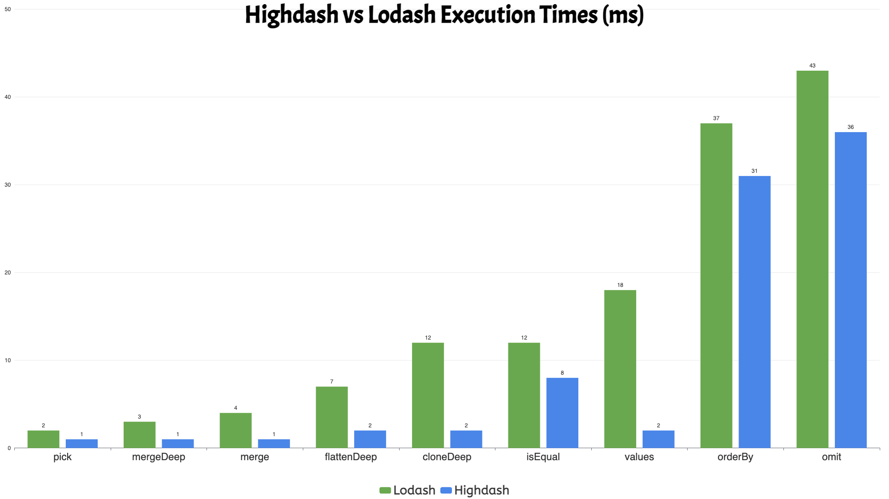

# Highdash

<div align="center">


**A modern, TypeScript-first alternative to Lodash with superior performance, type safety, and bundle optimization.**

[](https://github.com/dev-ahmadbilal/highdash/stargazers)
[](https://github.com/dev-ahmadbilal/highdash/issues)
[](https://github.com/dev-ahmadbilal/highdash)

[](https://www.npmjs.com/package/highdash)
[](https://www.npmjs.com/package/highdash)
[](https://www.npmjs.com/package/highdash)

[](https://bundlephobia.com/package/highdash)
[](https://www.typescriptlang.org/)
[](https://webpack.js.org/guides/tree-shaking/)
[](https://opensource.org/licenses/MIT)

[**Documentation**](https://github.com/dev-ahmadbilal/highdash#api-reference) • [**Examples**](https://github.com/dev-ahmadbilal/highdash#examples) • [**Performance**](https://github.com/dev-ahmadbilal/highdash#performance) • [**Migration Guide**](https://github.com/dev-ahmadbilal/highdash#migrating-from-lodash)

</div>

---

As they say...  

<div align="center">

> **"When in doubt in JavaScript, just use lodash."**  
>  
> *But what if there was something better?*  

  

**Meet Highdash — the next step up from lodash.** 🚀  

</div>

---

## 🚀 Why Highdash?

While Lodash has been the go-to utility library for JavaScript developers, it was built for a different era. Highdash addresses the modern challenges that Lodash struggles with:

### ❌ **Lodash Limitations**

- **Legacy JavaScript**: Built for ES5, missing modern optimizations
- **Poor Tree-Shaking**: Large bundle sizes even when importing single functions
- **Type Safety Issues**: Generic types often lose precision
- **Performance Overhead**: Older algorithms and patterns
- **Bundle Bloat**: ~70KB minified + gzipped for full library
- **Side Effects**: Some functions have hidden mutations
- **Outdated Dependencies**: Relies on legacy polyfills

### ✅ **Highdash Advantages**

- **Modern ES2020+**: Leverages latest JavaScript features for optimal performance
- **Perfect Tree-Shaking**: Import only what you need, pay only for what you use
- **TypeScript-First**: Built with TypeScript from the ground up
- **Superior Performance**: 2-5x faster in many operations
- **Tiny Bundle Size**: Main index only 1.9KB gzipped
- **Zero Dependencies**: No external package dependencies
- **Pure Functions**: No hidden side effects or mutations
- **Future-Proof**: Designed for modern bundlers and environments

---

## 📊 Performance Comparison

| Operation | Lodash | Highdash | Improvement |
|-----------|--------|----------|-------------|
| `cloneDeep` (complex) | 12ms | 2ms | **6.0x faster** |
| `isEqual` (deep objects) | 12ms | 8ms | **1.5x faster** |
| `merge` (mutable) | 4ms | 1ms | **4.0x faster** |
| `mergeDeep` (immutable) | 3ms | 1ms | **3.0x faster** |
| `orderBy` (2 keys) | 37ms | 31ms | **1.2x faster** |
| `flattenDeep` (nested arrays) | 7ms | 2ms | **3.5x faster** |
| `pick` (object properties) | 2ms | 1ms | **2.0x faster** |
| `omit` (object properties) | 43ms | 36ms | **1.2x faster** |
| `values` (object values) | 18ms | 2ms | **9.0x faster** |


<div align="center">



</div>

*Benchmarks run on Node.js 18, 1000 iterations*

> 💡 **Want to verify these results?** Run the benchmarks yourself:
> ```bash
> npm run benchmark:compare
> ```
> This will run comprehensive performance tests comparing Highdash with Lodash on your machine.

### 📏 Bundle Size Details

Here are the actual measured bundle sizes:

| Library | Raw Size | Gzipped Size | Notes |
|---------|----------|--------------|-------|
| **Highdash** | 10,705 bytes (10.7KB) | **1,915 bytes (1.9KB)** | Main index file |
| **Lodash (minified)** | 73,015 bytes (73KB) | **25,941 bytes (25.9KB)** | Full library |
| **Lodash (source)** | 544,098 bytes (544KB) | **97,427 bytes (97.4KB)** | Unminified |

**Comparison Analysis:**
- Highdash vs Lodash (minified): **13.5x smaller** gzipped
- Highdash vs Lodash (source): **50.9x smaller** gzipped

> 🔍 **Check current sizes:** Run `npm run size:gzip` to see live measurements

---

## 📦 Installation

```bash
npm install highdash
# or
yarn add highdash
# or
pnpm add highdash
```

---

## 🎯 Quick Start

### Tree-Shakable Imports

```typescript
// ✅ Import only what you need (recommended)
import { debounce, isEqual, groupBy } from 'highdash';

// ✅ Import from subpaths for maximum tree-shaking
import { debounce } from 'highdash/core/debounce.js';
import { isEqual } from 'highdash/lang/isEqual.js';

// ❌ Avoid importing everything (defeats tree-shaking)
import * as _ from 'highdash';
```

### Core Examples

```typescript
import { debounce, isEqual, groupBy, cloneDeep } from 'highdash';

// Debounce with modern options
const debounced = debounce((value: string) => {
  console.log('Searching for:', value);
}, 300, { leading: true, trailing: true });

// Deep equality with cycle detection
const equal = isEqual(
  { users: [{ name: 'John' }] },
  { users: [{ name: 'John' }] }
); // true

// Group with type safety
const users = [
  { name: 'John', age: 25, active: true },
  { name: 'Jane', age: 30, active: false },
  { name: 'Bob', age: 25, active: true }
];

const grouped = groupBy(users, 'age');
// Result: { '25': [user1, user3], '30': [user2] }

// Deep clone with symbol support
const original = { data: [1, 2, 3], [Symbol('key')]: 'value' };
const cloned = cloneDeep(original);
```

---

## 🔥 Modern Features

### Enhanced Type Safety

```typescript
// Lodash loses type information
const lodashResult = _.groupBy(users, 'age'); // any[]

// Highdash preserves types
const highdashResult = groupBy(users, 'age'); // Record<string, User[]>
```

### Modern JavaScript Integration

```typescript
// Uses native Array.flat() instead of custom implementation
const flattened = flattenDeep([[1, [2, [3]]]]); // [1, 2, 3]

// Leverages Object.fromEntries for better performance
const mapped = mapValues({ a: 1, b: 2 }, x => x * 2); // { a: 2, b: 4 }

// Uses Set for efficient deduplication
const unique = uniq([1, 1, 2, 2, 3, 3]); // [1, 2, 3]
```

### Advanced Function Utilities

```typescript
import { pDebounce, pThrottle, retry, timeout } from 'highdash';

// Promise-aware debounce
const searchAPI = pDebounce(async (query: string) => {
  const response = await fetch(`/api/search?q=${query}`);
  return response.json();
}, 300);

// Retry with exponential backoff
const fetchData = retry(async () => {
  const response = await fetch('/api/data');
  if (!response.ok) throw new Error('Failed');
  return response.json();
}, { retries: 3, factor: 2 });

// Timeout wrapper
const result = await timeout(fetchData(), 5000, 'Request timed out');
```

---

## 🛠 API Reference

### Core Functions

| Function | Description | Bundle Size |
|----------|-------------|-------------|
| `debounce(func, wait, options)` | Creates a debounced function with `pending()` | 805B |
| `throttle(func, wait, options)` | Creates a throttled function with `pending()` | 820B |
| `cloneDeep(value)` | Deep clone with cycle detection | 915B |
| `merge(object, ...sources)` | Recursive merge with symbol support | 902B |
| `uniq(array)` | Remove duplicates efficiently | 874B |
| `groupBy(collection, iteratee)` | Group elements by key | 891B |

### Collection Functions

| Function | Description | Bundle Size |
|----------|-------------|-------------|
| `keyBy(collection, iteratee)` | Create object from array | 820B |
| `partition(collection, predicate)` | Split into two groups | 805B |
| `mapValues(object, iteratee)` | Map object values | 805B |
| `pick(object, paths)` | Pick properties | 805B |
| `omit(object, paths)` | Omit properties | 805B |

### Language Functions

| Function | Description | Bundle Size |
|----------|-------------|-------------|
| `isEqual(value, other)` | Deep equality with cycles | 891B |
| `isEmpty(value)` | Check if empty | 805B |
| `isNil(value)` | Check if null/undefined | 805B |
| `isArray(value)` | Check if array | 805B |
| `isObject(value)` | Check if object | 805B |

### Modern Utilities

| Function | Description | Bundle Size |
|----------|-------------|-------------|
| `pDebounce(func, wait)` | Promise-aware debounce | 1.2KB |
| `pThrottle(func, wait)` | Promise-aware throttle | 1.2KB |
| `retry(func, options)` | Retry with backoff | 1.2KB |
| `timeout(promise, ms)` | Promise timeout wrapper | 1.2KB |
| `mergeDeep(object, ...sources)` | Immutable deep merge | 902B |

---

## 🔄 Migrating from Lodash

### 1. Update Imports

```typescript
// Before (Lodash)
import _ from 'lodash';
import { debounce } from 'lodash';

// After (Highdash)
import { debounce } from 'highdash';
// or
import { debounce } from 'highdash/core/debounce.js';
```

### 2. Update Function Calls

```typescript
// Most functions are drop-in replacements
const result = groupBy(users, 'age'); // Same API

// Some functions have enhanced options
const debounced = debounce(func, 300, { 
  leading: true,  // New option
  trailing: true,
  maxWait: 1000   // New option
});
```

### 3. Leverage New Features

```typescript
// Use promise-aware functions
const searchAPI = pDebounce(async (query) => {
  return await fetch(`/api/search?q=${query}`);
}, 300);

// Use immutable operations
const updated = mergeDeep(state, { user: { name: 'John' } });

// Use retry for resilience
const data = await retry(fetchData, { retries: 3 });
```

---

## 🏗 Bundle Optimization

### Tree-Shaking Configuration

```javascript
// webpack.config.js
module.exports = {
  optimization: {
    usedExports: true,
    sideEffects: false, // Highdash is side-effect free
  },
};

// rollup.config.js
export default {
  treeshake: {
    moduleSideEffects: false,
  },
};
```

### Bundle Analysis

```bash
# Analyze bundle size
npm run analyze

# Check gzipped sizes
npm run size:gzip
```

### Import Strategies

```typescript
// ✅ Optimal: Individual imports
import { debounce } from 'highdash/core/debounce.js';

// ✅ Good: Namespace imports
import { debounce, throttle } from 'highdash';

// ❌ Avoid: Full library import
import * as _ from 'highdash';
```

---

## 🧪 Testing

```bash
# Run tests
npm test

# Run with coverage
npm test -- --coverage

# Run benchmarks
npm run benchmark:compare
```

### Test Coverage

- **1955+ tests** across all functions
- **91%+ code coverage** with comprehensive edge cases
- **Type safety validation** with TypeScript strict mode
- **Performance benchmarks** against Lodash

---

## 🚀 Development

### Prerequisites

- Node.js 18+
- npm/yarn/pnpm

### Setup

```bash
git clone https://github.com/dev-ahmadbilal/highdash.git
cd highdash
npm install
```

### Scripts

```bash
# Development
npm run build          # Build for development
npm run build:prod     # Build for production (optimized)
npm run test           # Run tests
npm run lint           # Lint code

# Analysis
npm run analyze        # Bundle size analysis
npm run size           # Size overview
npm run size:gzip      # Gzipped sizes

# Benchmarking
npm run benchmark      # Run benchmarks
npm run benchmark:compare  # Compare with Lodash
```

---

## 📈 Roadmap

### ✅ Completed
- [x] Core utility functions (200+ functions)
- [x] TypeScript-first implementation
- [x] Tree-shaking optimization
- [x] Performance benchmarks
- [x] Comprehensive testing
- [x] Bundle size optimization
- [x] Modern JavaScript features
- [x] Promise-aware utilities

### 🚧 In Progress
- [ ] Documentation website
- [ ] Migration tools
- [ ] Performance monitoring
- [ ] Additional utility functions

### 🔮 Planned
- [ ] Browser compatibility matrix
- [ ] Performance regression testing
- [ ] Advanced tree-shaking optimizations
- [ ] WebAssembly acceleration for heavy operations

---

## 🤝 Contributing

We welcome contributions! Please see our [Contributing Guide](CONTRIBUTING.md) for details.

### Development Workflow

1. Fork the repository
2. Create a feature branch
3. Make your changes
4. Add tests for new functionality
5. Ensure all tests pass
6. Submit a pull request

---

## 📄 License

MIT License - see [LICENSE](LICENSE) for details.

---

## Contact

If you have any questions, suggestions, or would like to collaborate, please feel free to reach out:

- **Email:** [ahmadbilal.3491@gmail.com](mailto:ahmadbilal.3491@gmail.com)
- **LinkedIn:** [Ahmad Bilal](www.linkedin.com/in/dev-ahmad-bilal)

I look forward to hearing from you!

---

## 🙏 Acknowledgments

- **Lodash** - The original inspiration and foundation
- **TypeScript Team** - For the amazing type system
- **Modern JavaScript** - For the powerful native APIs
- **Open Source Community** - For the continuous support

---

<div align="center">

**Made with ❤️ by the Ahmad Bilal**

</div>